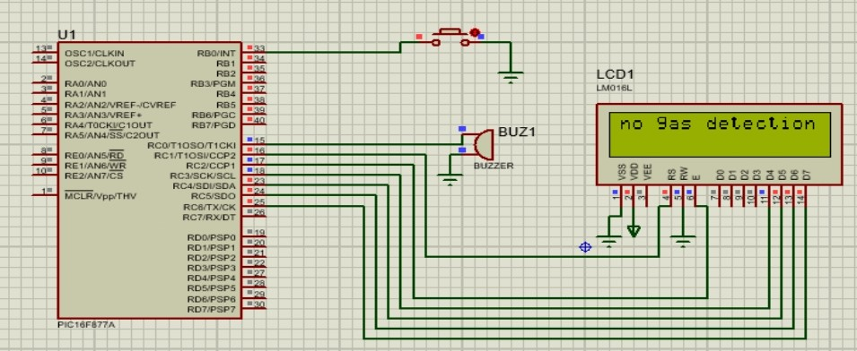
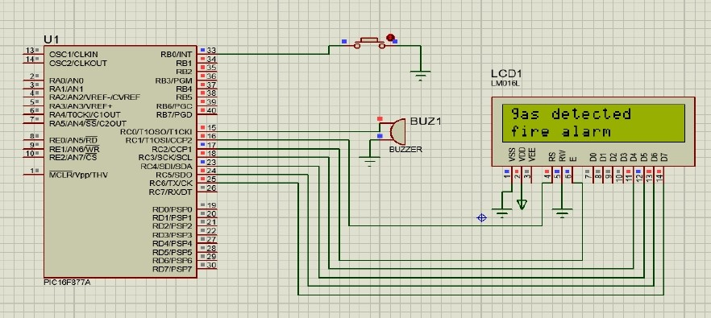

# Gas Detection System Using PIC16F877A

An academic Microcontrollers course project demonstrating PIC16F877A-based gas-alert logic through Proteus simulation. A simulated digital input triggers a buzzer and updates a 16×2 LCD.

## Academic Context

- **Project type:** Five-student academic team project  
- **Course:** Microcontrollers  
- **Semester:** Spring 2025  
- **Institution:** Middle East College, Oman  
- **My contribution:** I personally designed, programmed, and tested the simulated circuit and PIC firmware as part of the team project.

## Problem

Gas leaks can create serious safety risks. This project explored a simple microcontroller-based alert system that presents a normal or alert state through a 16×2 LCD and buzzer.

## System Design

- PIC16F877A microcontroller  
- 16×2 LCD in 4-bit mode  
- Push button used as a simulated gas-input signal  
- Buzzer output  
- Digital I/O  
- Proteus simulation  
- Embedded C  
- MPLAB X IDE  
- XC8 Compiler  

## Simulation Workflow

1. A push button represents the simulated gas-input condition.
2. The PIC16F877A reads the input through RB0.
3. In the normal state, the LCD displays `no gas detection`.
4. In the alert state, the buzzer is activated through RC0.
5. The LCD displays `gas detected fire alarm`.

## Validation

The normal and alert conditions were verified in Proteus simulation.

## Important Limitation

This is an academic simulation. It uses a push button as the input and does not include a physical gas sensor or validate gas-detection performance in a real environment.

## Simulation Results

### Normal condition

### Alert condition

## Skills Demonstrated

PIC16F877A · Embedded C · MPLAB X IDE · XC8 Compiler · Proteus · LCD Interfacing · Digital I/O · Firmware Development · Simulation Validation
